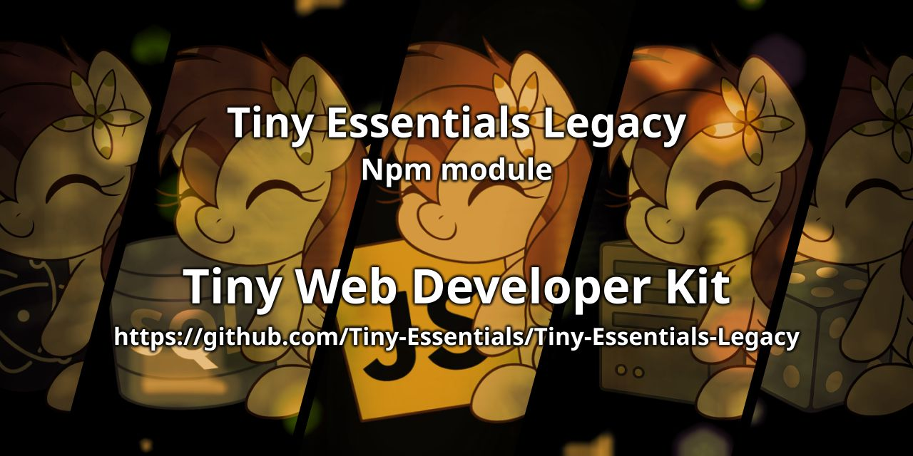

    
    
    
    

# Legacy Codes Folder

The **Legacy Codes** folder contains outdated code snippets that have been adapted to work with modern programming languages and environments. Despite their modernization, the original logic of all these codes has been preserved, regardless of whether the structure was well-organized or poorly structured.

### Key Points:
- **Original Logic Preserved:** All code retains its original functionality and structure, even if it was previously poorly organized or outdated.
- **Maintenance:** These codes will only receive updates for bug fixes or glitches when reported. No further improvements or new features will be added to them.
- **Feedback and New Versions:** Users can provide feedback, which may lead to the creation of updated versions. These new versions will be stored separately in the official code collection folder.

This folder is intended as a reference for legacy implementations that are no longer actively maintained but can still be useful for understanding older practices or for maintaining legacy systems.

## Preserved Modules

The following modules have been preserved in the **Legacy Codes** folder. While they are no longer actively developed, they have been updated to work with modern environments and retain their original logic and structure.

### `@tinypudding/firebase-lib`
A basic Firebase helper library originally designed to simplify common Firebase interactions. It maintains its old logic for initialization, database access, and authentication handling, while being compatible with current Firebase SDK versions.

### `@tinypudding/discord-oauth2`
A simple OAuth2 wrapper for Discord, created to manage login sessions and token handling for bots and applications. Its logic follows a basic flow and is kept intact for legacy support with Discord's API.

### `@tinypudding/mysql-connector`
A lightweight MySQL connector that offers a simplified interface for making queries and managing connections. Though its structure may not follow modern standards, it has been preserved for backwards compatibility with legacy Puddy Club projects.

### `@tinypudding/puddy-lib`
A utility library used internally in various Puddy Club projects. It includes a collection of small helper functions and patching tools. The logic is unchanged, though some functions may now rely on modern JavaScript syntax to remain compatible.

These modules will only receive updates for critical bug fixes. Feedback is welcome and may lead to fully reworked versions being released in parallel with the current official code collection.

---

## Back to Tiny Essentials

Did you like this module? It’s part of the **Tiny Essentials** collection — a set of minimal yet powerful tools to make development easier.
👉 [Click here to explore more Tiny Essentials modules](https://github.com/Tiny-Essentials/Tiny-Essentials)
